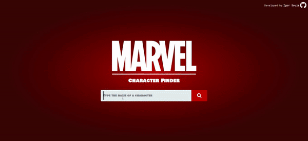

# Marvel Character Finder

  

## Overview

This is a React App that allows the user to search his favorite Marvel characters using the data available from the [Marvel API](https://developer.marvel.com/documentation/getting_started). This app does'nt use directly the Marvel API, it uses the MarvelQL library, which is a GraphQL wrapper for the REST API. In order to consume this GraphQL data, I'm using the Apollo Client.

The app also features an editing page but it doesn't send data to the Marvel API, the changes made within the app are only locally, they are stored in a Redux store.

## Setting up

### Requirements

- [Node.js](https://nodejs.org/en/download/)
- [Npm](https://www.npmjs.com/get-npm)
- [Yarn](https://yarnpkg.com/lang/en/docs/install/#debian-stable) - This is optional but in this readme I'll be using it on some CLI commands, you can use npm if you want.

### Dependencies

- [React.js](https://reactjs.org/) - JavaScript library for building user interfaces
- [MarvelQL](https://github.com/Novvum/MarvelQL) - An open source GraphQL API that wraps the Marvel REST API
- [Apollo Client](https://www.apollographql.com/docs/react/) - A fully-featured caching GraphQL client
- [Styled Components](https://styled-components.com/) - Library that lets you write actual CSS inside JavaScript
- [Redux](https://redux.js.org/) - Predictable state container for JavaScript apps.
- [React Redux](https://react-redux.js.org/) - Official React binding for Redux.
- [React Icons](https://react-icons.netlify.com/) - Icons library
- [React Router Dom](https://reacttraining.com/react-router/web/guides/quick-start) - DOM bindings for React Router.

### Dev Dependencies

- [Eslint](https://eslint.org) - Ecmascript linter
- [Prettier](https://prettier.io) - Code formatter
- [React Testing library](https://testing-library.com/docs/react-testing-library/intro) - Light-weight solution for testing React components

## Installing

All you need to do is run `yarn` at the root of the project in order to install the dependencies.

## Running

Run the command `yarn start` for a developer environment or `yarn build` to generate the production build.

## License

This is a open-sourced software licensed under the [MIT license](LICENSE.md).
